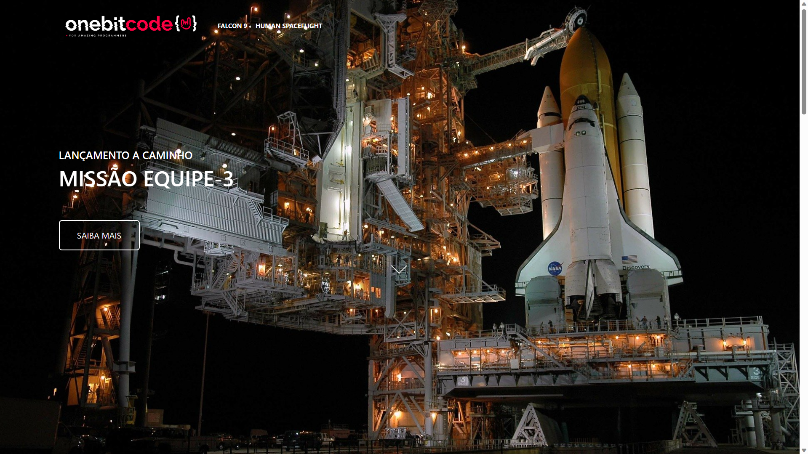

# [OneBitX](https://leoodrano.github.io/OneBitX/)

### Status: ✅Finalizado! 

 

#### 🗒️| Sobre:

- Landing Page inspirada no site da SpaceX, feita como atividade final do módulo de BootStrap, do curso FullStack Javascript da OneBitCode.

 

#### 🖼️| Imagens: 

 

 

🛠️| Tecnologias utilizadas:
- HTML
- CSS
- Sass
- Bootstrap
- [AOS - Animate on Scroll](https://github.com/michalsnik/aos)

    
